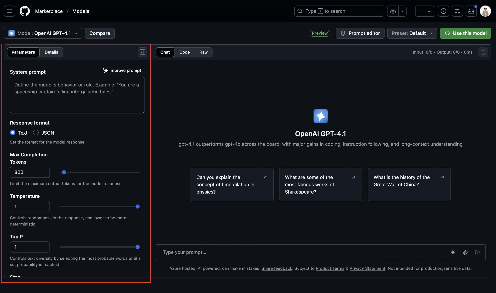

# Parameter Tuning Guide

> **Note:** Some parameters may only be supported by specific providers or models. Always check the model card in the Marketplace for details.

## Key Parameters
1. **Temperature** (0-2)
   - Lower = more deterministic
   - Higher = more creative/random

2. **Max Tokens** (1-8000)
   - Limits response length
   - Affects rate limit consumption

3. **Top P** (0-1)
   - Probability mass cutoff
   - Alternative to temperature

4. **Frequency Penalty** (-2 to 2)
   - Reduces repetition
   - Positive values discourage repeated phrases

5. **Presence Penalty** (-2 to 2)
   - Encourages new topics
   - Positive values promote novelty

## Tuning Strategy
1. Start with defaults
2. Identify desired improvements
3. Adjust one parameter at a time
4. Test with consistent prompts
5. Document changes and effects

## Common Scenarios
- **Factual Accuracy**: Lower temperature
- **Creativity**: Higher temperature
- **Concise Outputs**: Lower max tokens
- **Variety**: Adjust penalties